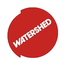

## InkerLinker

### Documentation Not Complete

InkerLinker is a custom node based editor that enables users to rapidly prototype interactive scenarios using the Bare Conductive Touch Board, Conductive Ink, Copper Tape and openFrameworks. 

**For example**: Users can trigger video content, HTTP requests, OSC, QLab actions all from the Bare Conductive TouchBoard.

<strong>No need to write code.</strong>

Simply drag cords between the virtual touch board and nodes to create actions.

Written in C++ using openFrameworks 0.9.8.

**Currently Mac Only**

## Quick Start

Download the Application from the **Wiki**.

You need to upload the **DataStream** Sketch to the Touchboard to use InkerLinker.

But first you need to change one variable inside the sketch.

On line 36-37 change **releaseThreshold** to 30.

Without altering this variable the touch board thinks there has been no release event.
 
~~~
// this is the touch threshold - setting it low makes it more like a proximity trigger
// default value is 40 for touch

const int touchThreshold = 40;

// this is the release threshold - must ALWAYS be smaller than the touch threshold
// default value is 20 for touch

const int releaseThreshold = 20;
~~~

### Documentation

* [How to Use](./docs/usage.md)
* [How to Compile](./docs/compilation.md)
* [How to Extend](./docs/extending.md)
* [Issues](issues.md)

### Thanks To

* [Bare Conductive](https://www.bareconductive.com/)
* [Elie Génard](https://github.com/elaye) for the ofxTouchBoard Addon.
* [Adam Kozłowski](https://github.com/killpl/obd_cougar/tree/master/cougar_lib/serial) for the USB recognition code.
* [Tom Metcalfe](http://www.thomasbuchanan.uk/)
* [All of the Pervasive Media Studio Team](http://www.watershed.co.uk/studio/about/team)
* Watershed's ICT Team. Oliver Humpage, Stewart Morgan and Alex Heal.

The openFrameworks community.